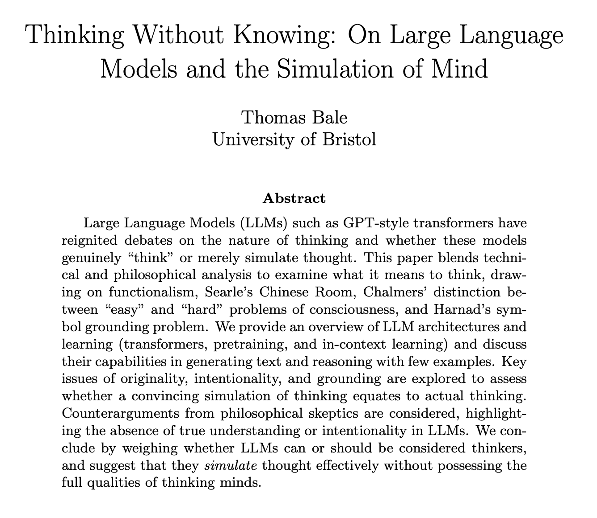
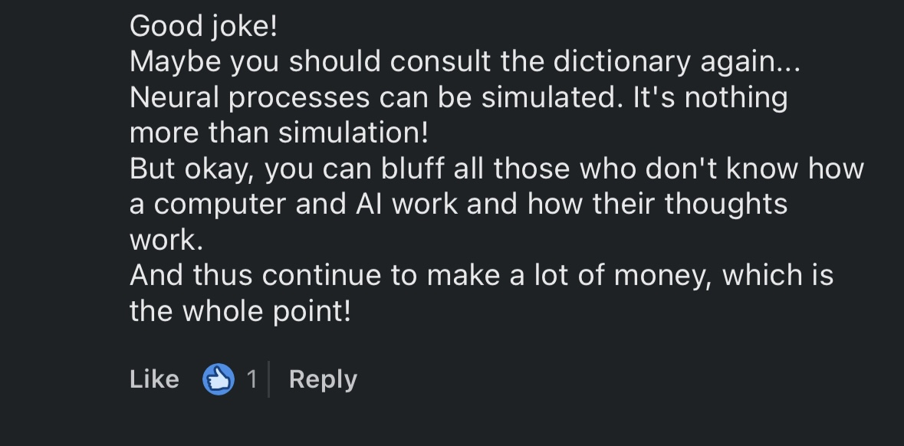
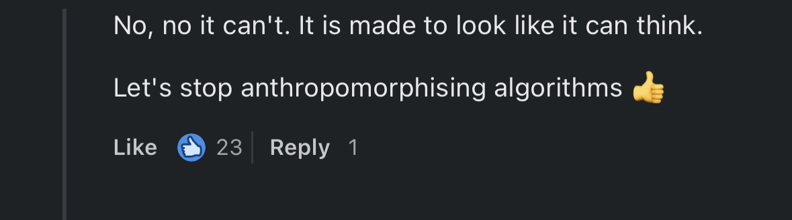

# Do LLMs Think?

## Background

Sitting in the library, desperate to procrastinate, I look through devpost for hackathons to sign up to. "Build Agenic AI" What?! Intrguied nonetheless, I start doing research on where we are currently: the start of a philosophical rabbit hole about thinking. After an adequate amount of procrastination, I put this aside.

Until I see these comments:

Under a linkedIn post claiming that Ollama can think. So, I do the natural thing and write my first paper.

## The Paper

[Download the paper](../items/thinking.pdf)